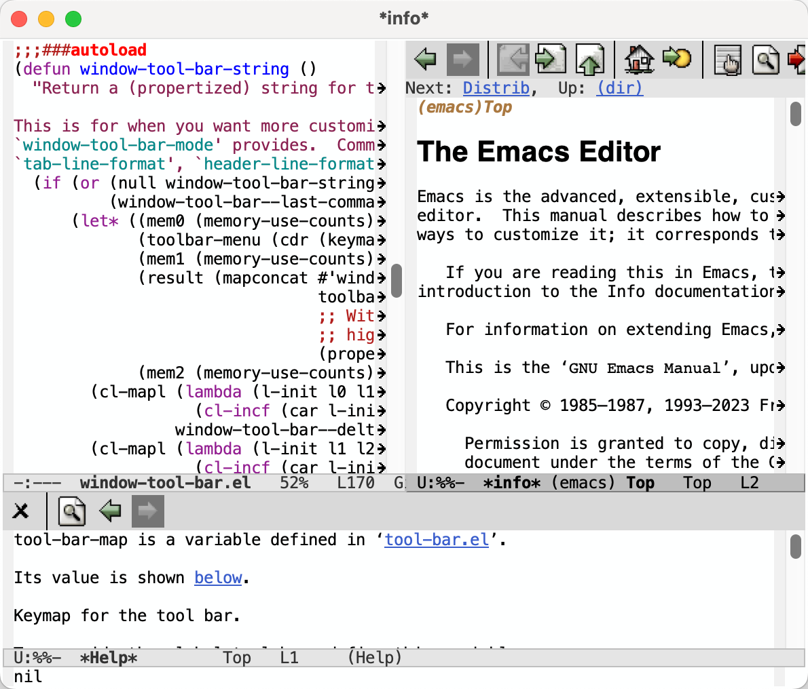

# Window Tool Bar Mode

Add tool bars to windows.  Clean up the default tool bar bindings.
Make tool bars work in terminals.

## Installation

The easiest way to install window-tool-bar-mode is on GNU Emacs 29 via
`package-vc-install`. Just run `M-x package-vc-install RET
http://github.com/chaosemer/window-tool-bar-mode RET`. This installs
the package locally.
