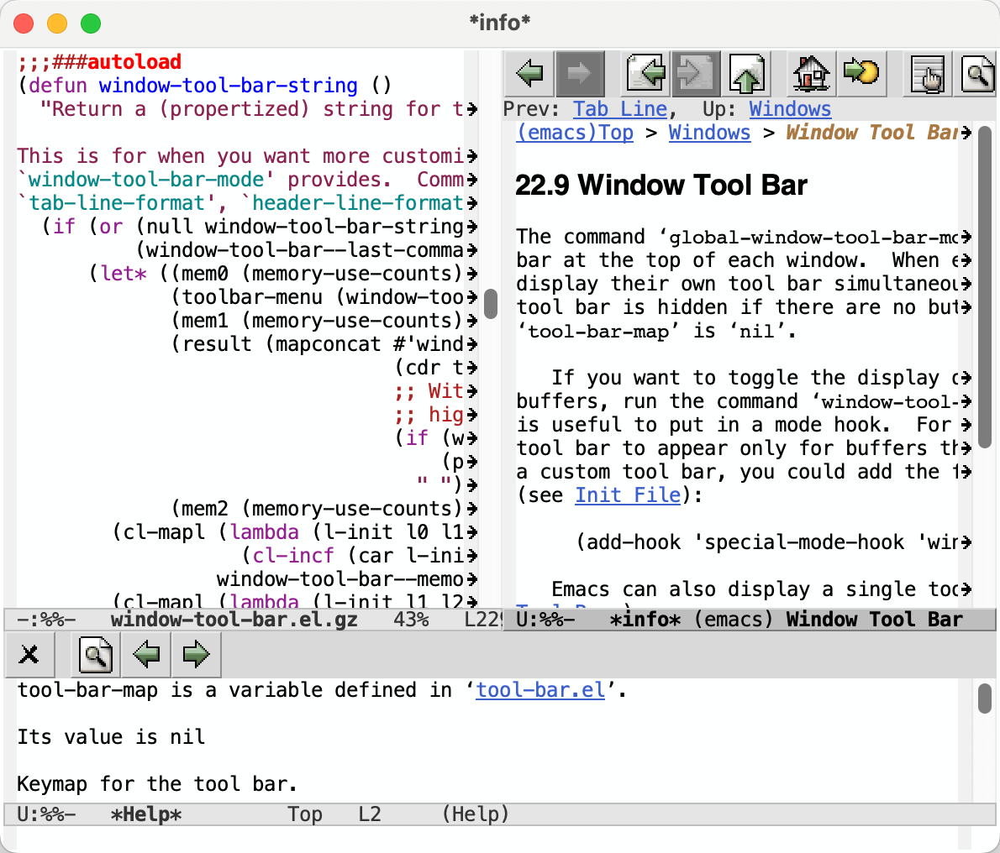

# Window Tool Bar Mode

Add tool bars to windows.  Keep tool bars clean and useful for
experienced Emacs users.

You may really like this package if any of the following is true:

* You like tool bars, but find Emacs' default tool bar not helpful
  because you already know how to do basic commands like open file,
  save file, cut, copy, or paste.
* You use the mouse when "browsing", like in help or info mode.
* You use `mouse-autoselect-window` and would like to use tool bars.
* You like how VSCode does tool bars.

By putting a tool bar in each window, you can see multiple tool bars
simultaneously directly next to the buffer the tool bar acts on.  This
works especially well with in modes such as \*info\*, \*help\*, and
\*eww\*.

## Installation

Installing is as simple as `M-x package-install RET window-tool-bar`.
Additionally, on GNU Emacs 29 and higher, you can run `M-x
package-vc-install RET
http://github.com/chaosemer/window-tool-bar-mode` to install directly
from source.

## Customization

The default behavior is to make the per-window tab line show the tool
bar for that buffer.  To enable this behavior either add
`(global-window-tool-bar-mode 1)` to your init file or enable via
customize via `M-x` `customize-group` `RET` `window-tool-bar` `RET`.
If you want to enable for only specific modes, you can add
`window-tool-bar-mode` to mode specific hooks.

It is common to only want to show mode specific tool bars and not the
default tool bar.  To do this, add `(setq tool-bar-map nil)` to your
init file.  This is the configuration the author of this package uses.

If you want to share the tool bar with an existing tab line, add
`(:eval (window-tool-bar-string))` to `tab-line-format`.  You can also
add this to `mode-line-format` or `header-line-format`.  This is
recommended if you already are using the tab line for other things,
like displaying tabs.
